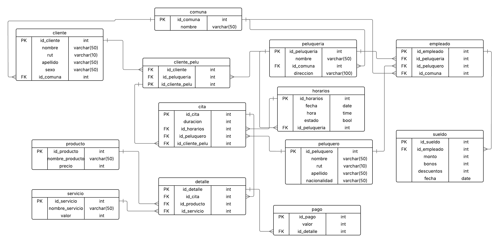

<h1> Control 1 <small><small><small>(Grupo 3)</small></small></small>
</h1>

A continuación estan todos los cambios hechos del esquema base entregado, el cual se muestra acontinuación:

Y acontinuación esta el esquema hecho por el grupo

<h3> Cambios Realizados </h3>

- precios son tratados
en CLP, no se justifica uso de double o float
-
-
-
-